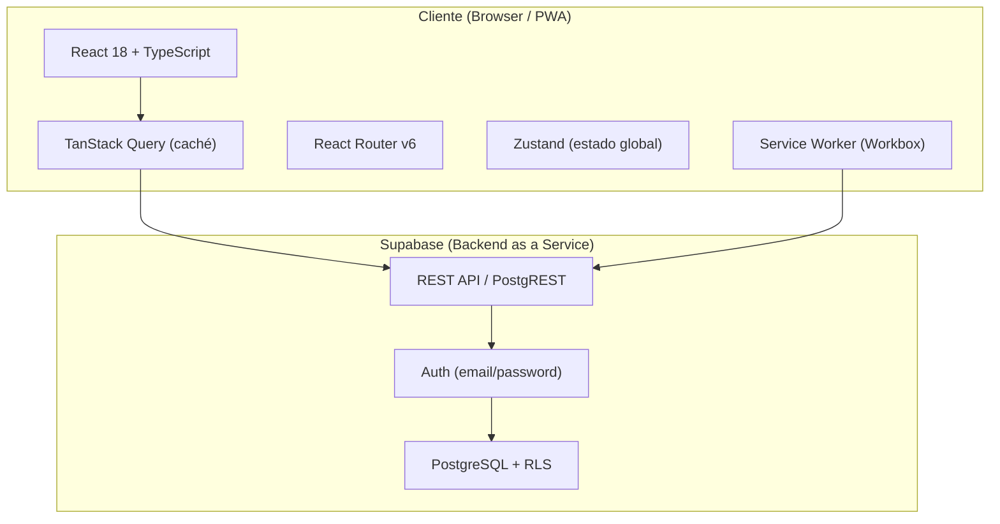

# Arquitectura del Sistema — ESLIDER Ministry Manager

> Última actualización: 2026-06-27

## Visión general

App web PWA para gestionar el Ministerio de Formación de ESLIDER. Permite registrar personas, hacer seguimiento de su ruta de formación espiritual, registrar asistencia, delegar tareas a líderes y generar reportes.



## Stack tecnológico

| Capa | Tecnología | Por qué |
|---|---|---|
| Framework | React 18 + TypeScript | Ecosistema amplio, componentes funcionales |
| Build tool | Vite 8 | Rápido en desarrollo, HMR instantáneo |
| Backend | Supabase (PostgreSQL) | Datos relacionales, Auth, RLS, sin servidor propio |
| Routing | React Router v6 | Estándar de facto en React SPAs |
| Server state | TanStack Query v5 | Caché, loading/error automáticos, invalidación |
| Global state | Zustand | Solo para estado que TanStack Query no cubre (ej: UI state) |
| UI | Tailwind CSS v4 + shadcn/ui | Componentes propios en el proyecto, sin dependencia externa |
| PWA | vite-plugin-pwa (Workbox) | Instalable en móvil, funciona offline parcialmente |

## Estructura de carpetas

```
src/
├── features/              # Un módulo por feature de negocio
│   ├── people/            # M1 — Miembros y visitantes
│   ├── ministries/        # M2 — Ministerios y líderes
│   ├── formation/         # M3 — Ruta de formación (CORE)
│   ├── attendance/        # M4 — Asistencia a sesiones
│   ├── tasks/             # M5 — Delegación de tareas
│   ├── notes/             # M6 — Notas de exposiciones
│   └── leader-tracking/   # M7 — Seguimiento 1:1
├── components/ui/         # Componentes shadcn/ui
├── components/            # Componentes compartidos
├── hooks/                 # Custom hooks globales
├── lib/
│   └── supabase.ts        # Cliente Supabase (único)
├── pages/                 # Páginas — conectan features con el router
├── router/                # Definición de rutas
├── store/                 # Zustand stores
└── types/
    └── supabase.ts        # Tipos generados desde el schema de BD
```

Cada feature sigue esta estructura interna:
```
features/people/
├── components/   # Componentes específicos de esta feature
├── hooks/        # useQuery y useMutation de esta feature
├── types.ts      # Tipos locales
└── index.ts      # Re-exports públicos
```

## Usuarios y roles

| Rol | Permisos | Acceso |
|---|---|---|
| Admin (Jorge) | Lectura + escritura total | Todas las pantallas |
| Secretario | Lectura + escritura total | Todas las pantallas |
| Pastor | Solo lectura | Todas las pantallas (sin botones de edición) |
| Líder | Su propio perfil y tareas | Fase futura |

## Hosting

Por definir. Candidatos:
- **Vercel** — gratis para SPAs, deploy automático desde GitHub
- **Netlify** — similar a Vercel
- **Cloudflare Pages** — muy rápido, gratis

> La app es una SPA (Single Page Application) — cualquier host de archivos estáticos sirve.

## Decisiones de arquitectura

Ver `docs/decisions/` para el detalle de cada decisión.

Resumen:
- **Vite sobre Next.js** — app interna sin SEO, SPA es suficiente
- **Supabase sobre Firebase** — datos relacionales se modelan mejor en PostgreSQL
- **TanStack Query sobre useEffect+fetch** — caché, loading, error automáticos
- **shadcn/ui sobre MUI/Chakra** — componentes en el proyecto, control total
- **PWA** — líderes usan la app desde móvil en campo
