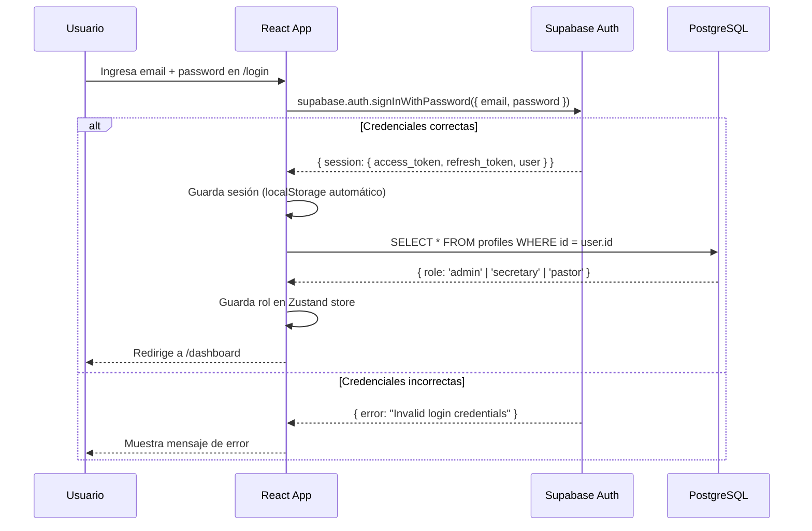
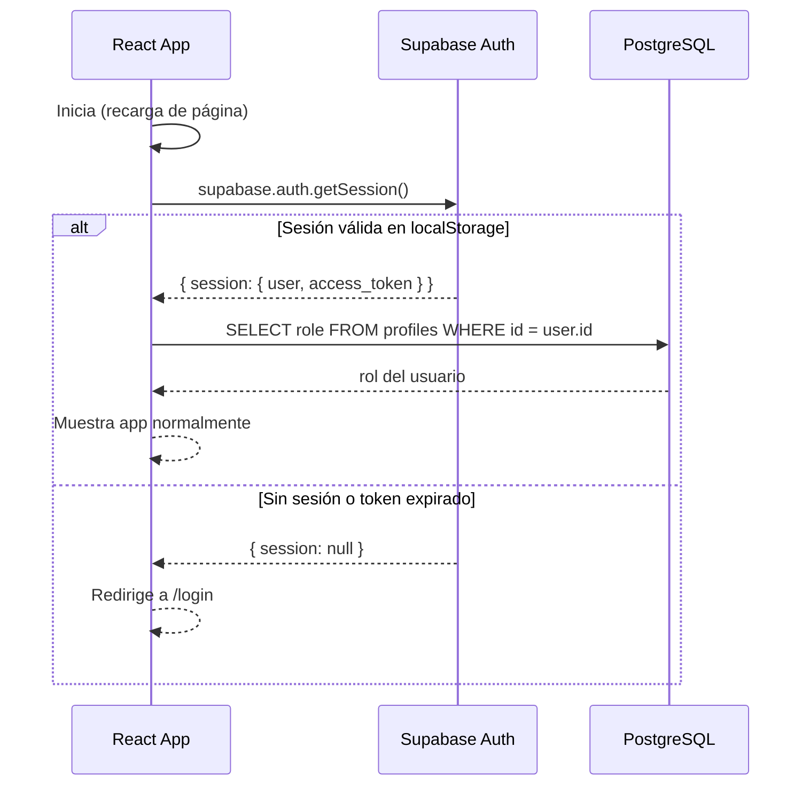
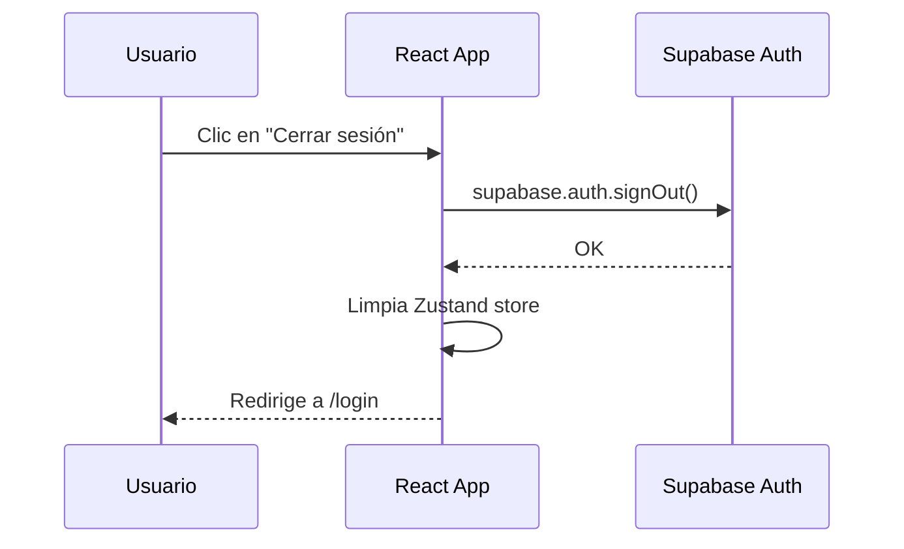
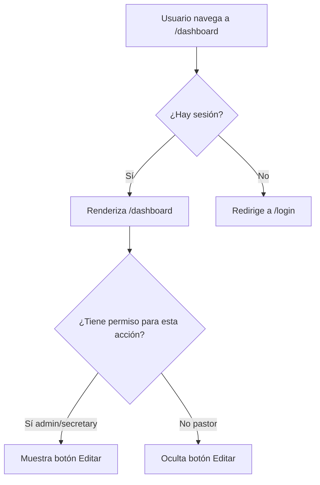

# Flujo de Autenticación — ESLIDER Ministry Manager

> Última actualización: 2026-06-27

## Proveedor

Supabase Auth con email y password. No hay registro público — el admin crea los usuarios manualmente desde el panel de Supabase.

## Flujo de login

## Flujo de sesión persistente

Cuando el usuario recarga la página, no tiene que volver a hacer login:

## Flujo de logout

## Protección de rutas

Las rutas privadas verifican si hay sesión activa. Si no la hay, redirigen a `/login`:

## Renovación automática del token

El JWT expira cada 1 hora. Supabase JS renueva el token automáticamente usando el `refresh_token` (válido por 7 días) sin que el usuario note nada.

## Gestión de usuarios

Los usuarios se crean manualmente desde el panel de Supabase → Authentication → Users. Después del primer login, se crea automáticamente el registro en `profiles` (esto lo implementaremos con un trigger o desde el código al primer login).

## Roles y permisos

| Rol | Login | Ver datos | Crear/Editar/Borrar |
|---|---|---|---|
| `admin` | ✅ | ✅ | ✅ |
| `secretary` | ✅ | ✅ | ✅ |
| `pastor` | ✅ | ✅ | ❌ |

El control de permisos tiene dos capas:
1. **UI** — ocultar botones de edición para el pastor
2. **RLS** — aunque el pastor intente la operación directamente, la BD la bloquea
