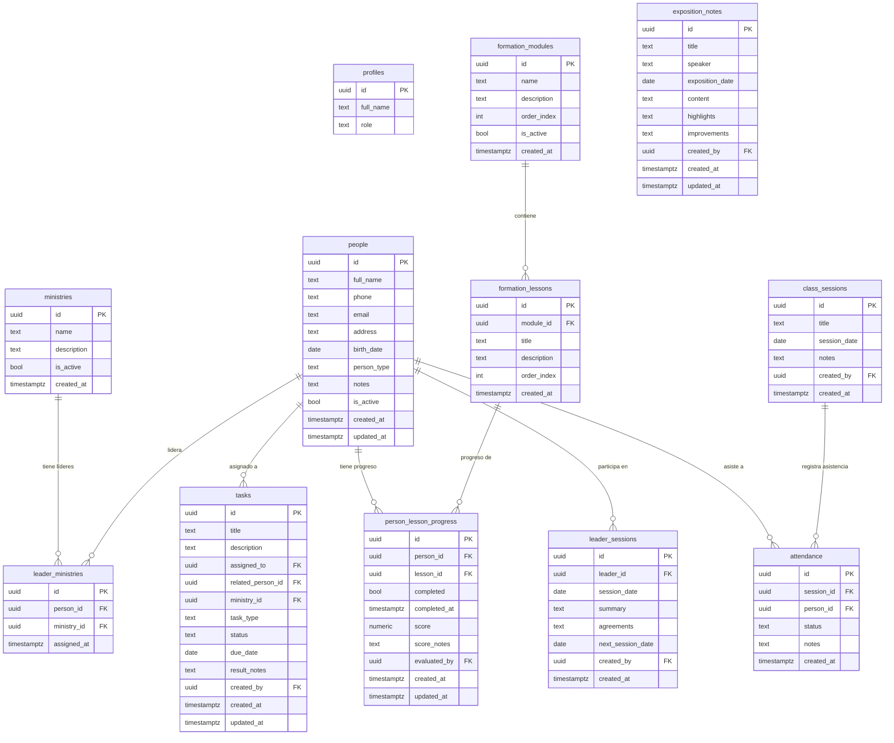

# Base de Datos — ESLIDER Ministry Manager

> Última actualización: 2026-06-27
> Motor: PostgreSQL 17 en Supabase (proyecto: local-ministry)

## Diagrama ERD



## Descripción de tablas

### `profiles`
Extiende `auth.users` de Supabase. Un registro por cada usuario de la app (admin, secretario, pastor). Se crea automáticamente al hacer login por primera vez.

| Campo | Tipo | Descripción |
|---|---|---|
| `id` | uuid | Mismo ID que `auth.users` |
| `full_name` | text | Nombre completo del usuario |
| `role` | text | `admin` \| `secretary` \| `pastor` |

### `people`
El catálogo central de todas las personas del ministerio.

| Campo | Tipo | Descripción |
|---|---|---|
| `person_type` | text | `member` \| `believer` \| `visitor` |
| `is_active` | bool | Para archivar sin borrar |

> **member** = Miembro formal · **believer** = Creyente nuevo en formación · **visitor** = Visitante frecuente

### `ministries`
Catálogo de los ~15 ministerios. Gestionable desde la app.

### `leader_ministries`
Tabla intermedia para la relación muchos a muchos entre `people` y `ministries`. Un líder puede tener varios ministerios; un ministerio puede tener varios líderes.

### `formation_modules`
Módulos del currículo de formación (básico → avanzado). El admin los define desde la app. El campo `order_index` determina el orden de visualización.

### `formation_lessons`
Lecciones dentro de cada módulo. También tienen `order_index`.

### `person_lesson_progress` ⭐ CORE
El corazón del sistema. Registra el avance de cada persona en cada lección.

| Campo | Descripción |
|---|---|
| `completed` | Si la lección fue vista/completada |
| `score` | Nota opcional (0-100). `NULL` = sin evaluar |
| `score_notes` | Observaciones del evaluador |
| `evaluated_by` | Qué usuario puso la nota |

**Cálculo de promedio:**
```sql
-- Promedio por módulo para una persona
SELECT
  fm.name AS module_name,
  AVG(plp.score) AS average_score
FROM person_lesson_progress plp
JOIN formation_lessons fl ON fl.id = plp.lesson_id
JOIN formation_modules fm ON fm.id = fl.module_id
WHERE plp.person_id = 'uuid-de-la-persona'
  AND plp.score IS NOT NULL
GROUP BY fm.id, fm.name;
```

### `class_sessions`
Sesiones de clase o culto. Cada sesión tiene una fecha y un título (ej: "Culto 27 Jun").

### `attendance`
Asistencia por persona por sesión. Estados: `present` | `absent` | `justified` | `late`

### `tasks`
Tareas delegadas a líderes. Pueden ser generales o ligadas a una persona específica (`related_person_id`).

| `task_type` | Descripción |
|---|---|
| `visit` | Visitar a alguien específico |
| `administrative` | Tarea administrativa |
| `other` | Otro tipo |

| `status` | Descripción |
|---|---|
| `pending` | Sin empezar |
| `in_progress` | En curso |
| `done` | Completada |

### `exposition_notes`
Notas de exposiciones con evaluación cualitativa separada en `highlights` (lo bueno) e `improvements` (por mejorar).

### `leader_sessions`
Sesiones 1:1 entre el admin y un líder. Incluye acuerdos y fecha de próxima sesión.

## Seguridad

- RLS habilitado en todas las tablas
- Política actual: solo usuarios autenticados pueden leer y escribir
- Política futura (Sprint 2): pastor solo puede leer; admin y secretary pueden escribir

## Migraciones

| Migración | Fecha | Descripción |
|---|---|---|
| `initial_schema` | 2026-06-27 | Creación de las 12 tablas con RLS |
