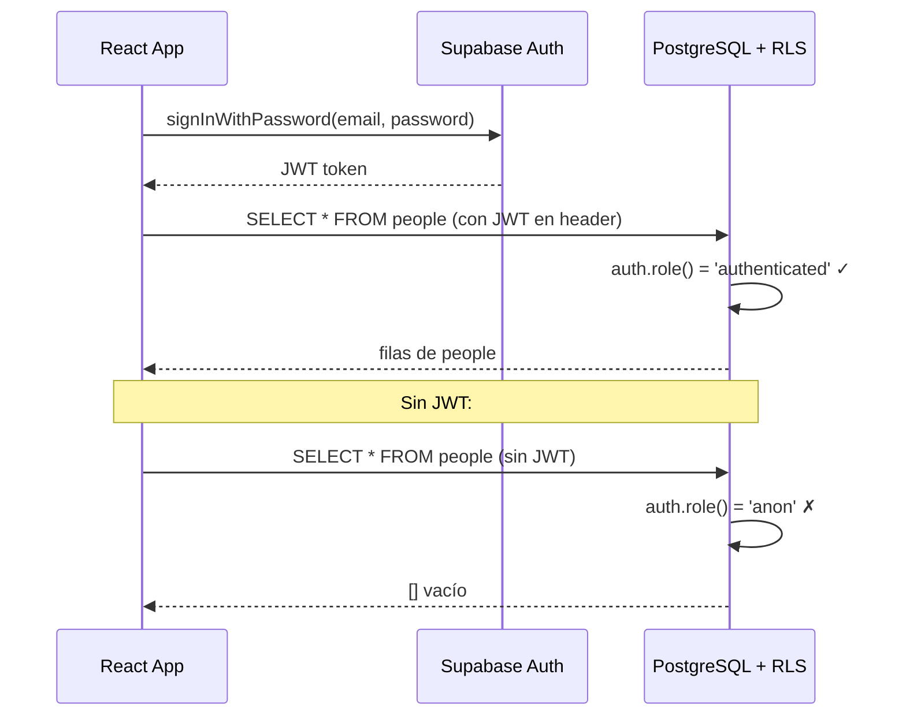

# RLS — Row Level Security

## ¿Qué es?

RLS es seguridad a nivel de **fila** dentro de la base de datos. En lugar de proteger solo el acceso a la tabla completa, PostgreSQL puede decidir qué filas específicas puede ver o modificar cada usuario.

Sin RLS, si alguien obtiene tu `anon key`, puede hacer esto directamente desde el navegador:
```
GET https://tu-proyecto.supabase.co/rest/v1/people
→ devuelve TODOS los registros sin restricción
```

Con RLS activo, la misma petición sin un JWT válido devuelve:
```json
[]   ← vacío, porque la política lo bloquea
```

## ¿A qué está ligado?

A **Supabase Auth**. Cuando un usuario hace login, Supabase genera un JWT (token firmado). Ese token viaja en cada request:

```
Login → JWT token → adjunto en headers → RLS verifica → permite o bloquea
```

La función `auth.role()` dentro de una política devuelve:
- `'anon'` → usuario no logueado (solo tiene la anon key)
- `'authenticated'` → usuario con sesión activa

## Política que tenemos ahora

```sql
CREATE POLICY "authenticated_read" ON people
  FOR SELECT USING (auth.role() = 'authenticated');
```

Traducción: "Solo permite SELECT en `people` si el usuario está autenticado."

## Secuencia completa



## Alternativas

| Enfoque | Seguridad | Complejidad | Cuándo usarlo |
|---|---|---|---|
| RLS (lo que usamos) | Alta | Media | Múltiples roles, datos sensibles |
| Sin RLS + validación en app | Media | Baja | App interna, un solo usuario |
| Service role key | Total (bypasea todo) | Baja | Solo en servidor backend, NUNCA en cliente |

## ¿Es más lenta?

Hay un overhead mínimo, imperceptible para apps con menos de millones de filas. Supabase está optimizado para RLS y lo recomienda por defecto.

## Próximo paso con RLS

Cuando agreguemos el rol `pastor` (solo lectura), la política se refina así:

```sql
-- Solo admin y secretary pueden escribir
CREATE POLICY "write_policy" ON people
  FOR INSERT, UPDATE, DELETE
  USING (
    EXISTS (
      SELECT 1 FROM profiles
      WHERE profiles.id = auth.uid()
      AND profiles.role IN ('admin', 'secretary')
    )
  );
```
