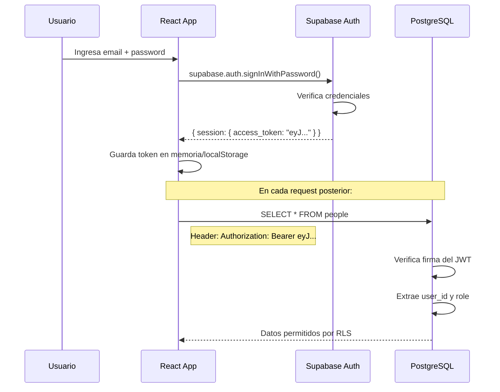

# JWT Token — JSON Web Token

## ¿Qué es?

Un JWT es un **token firmado** que Supabase genera cuando un usuario hace login. Contiene información del usuario codificada en base64 y una firma que garantiza que nadie lo falsificó.

Tiene tres partes separadas por puntos:
```
eyJhbGciOiJIUzI1NiJ9   ← Header (algoritmo)
.eyJ1c2VyX2lkIjoiMTIz  ← Payload (datos del usuario)
.SflKxwRJSMeKKF2QT4fw  ← Signature (verificación)
```

Si decodificas el payload verías algo así:
```json
{
  "sub": "uuid-del-usuario",
  "email": "jorge@eslider.com",
  "role": "authenticated",
  "exp": 1782494116
}
```

## ¿Cómo fluye en la app?



## ¿Dónde vive el token en la app?

Supabase JS lo maneja automáticamente — lo guarda en `localStorage` y lo adjunta en cada request sin que tengas que hacer nada. Cuando el token expira (por defecto 1 hora), Supabase lo renueva automáticamente usando el `refresh_token`.

## Diferencia con la anon key

| | Anon Key | JWT Token |
|---|---|---|
| Quién lo tiene | Cualquiera que vea el código fuente | Solo usuarios logueados |
| Qué identifica | El proyecto de Supabase | El usuario específico |
| `auth.role()` | `'anon'` | `'authenticated'` |
| `auth.uid()` | `null` | UUID del usuario |

## En código

```ts
// Obtener el usuario actual desde el token
const { data: { user } } = await supabase.auth.getUser()
console.log(user?.id)    // UUID del usuario
console.log(user?.email) // email

// Escuchar cambios de sesión (login/logout)
supabase.auth.onAuthStateChange((event, session) => {
  if (event === 'SIGNED_IN') console.log('Usuario logueado')
  if (event === 'SIGNED_OUT') console.log('Usuario deslogueado')
})
```
