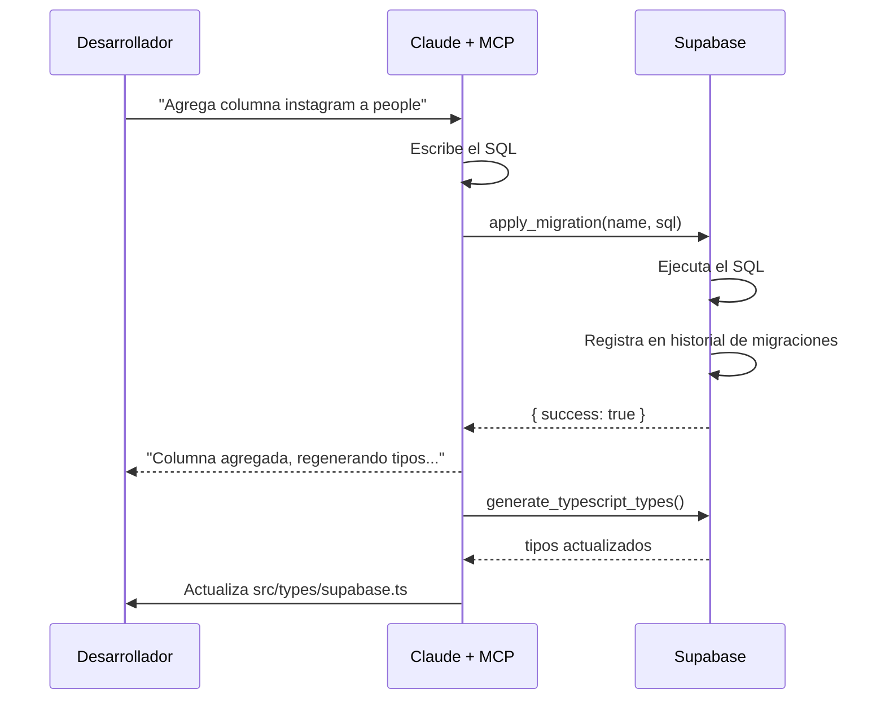

# Migraciones de Base de Datos

## ¿Qué es una migración?

Una migración es un **archivo SQL versionado** que describe un cambio al schema de la base de datos. En lugar de entrar al panel de Supabase y editar tablas manualmente, cada cambio queda registrado como un script que se puede reproducir, revertir y compartir.

## ¿Por qué no editar manualmente?

Si editas una tabla desde el panel de Supabase y algo sale mal:
- No tienes historial de qué cambió
- No puedes revertir fácilmente
- Tu equipo no sabe qué cambió

Con migraciones:
```
migration_001_initial_schema.sql  ← crea las tablas base
migration_002_add_phone_to_people.sql  ← agrega columna
migration_003_add_index_attendance.sql  ← optimización
```

Supabase guarda el historial y sabe cuáles ya se aplicaron.

## Secuencia de una migración



## En este proyecto

Usamos el **Supabase MCP** para aplicar migraciones directamente desde Claude sin salir de la conversación. El MCP llama a `apply_migration` que es equivalente a:

```bash
supabase db push  # CLI de Supabase
```

## Cómo agregar una columna nueva (ejemplo)

Si mañana quieres agregar Instagram a `people`:

```sql
ALTER TABLE people
ADD COLUMN instagram text;
```

Esto es una migración pequeña. Claude la aplicaría con `apply_migration` y luego regeneraría los tipos TypeScript automáticamente.

## Regla del proyecto

> **Nunca modificar tablas desde el panel de Supabase directamente.**
> Siempre pedirle a Claude que aplique una migración — así queda en el historial.
