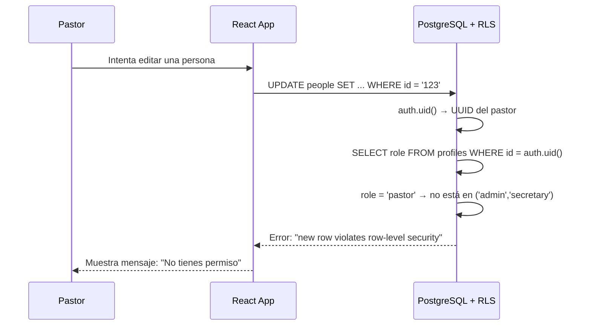
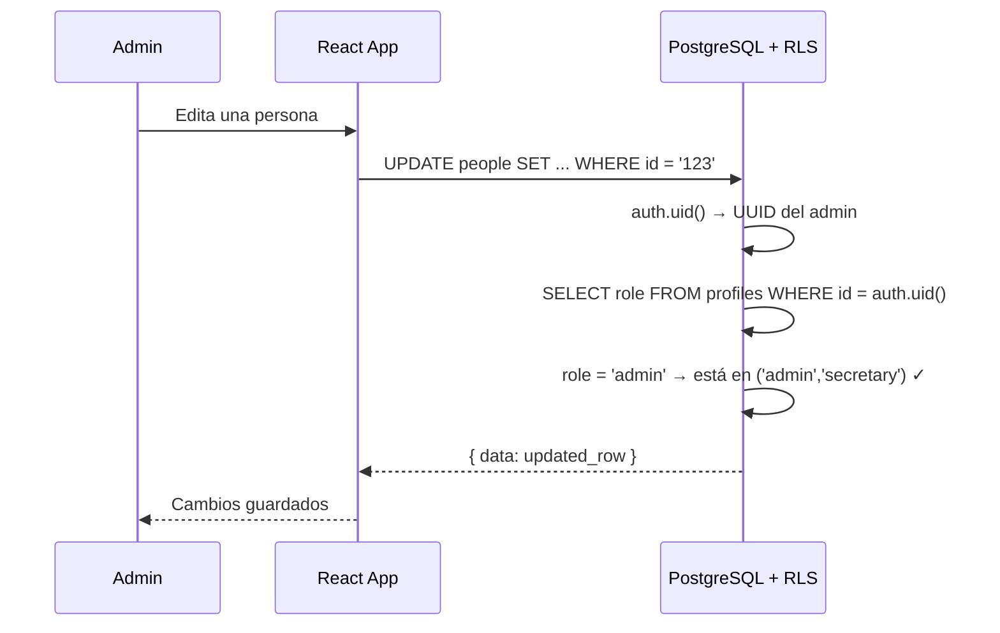

# RLS con Roles — Admin, Secretario y Pastor

## El problema

Tenemos tres tipos de usuario en la app:
- **Admin (Jorge):** acceso total — leer y escribir todo
- **Secretario:** acceso total — leer y escribir todo
- **Pastor:** solo lectura — puede ver pero no modificar nada

La política actual permite que cualquier usuario autenticado haga todo. Hay que refinarla.

## La tabla `profiles`

El rol de cada usuario vive en la tabla `profiles`:

```sql
profiles (
  id   uuid  → referencia a auth.users
  role text  → 'admin' | 'secretary' | 'pastor'
)
```

Cuando alguien hace login, su UUID viene en `auth.uid()`. Podemos cruzarlo con `profiles` para saber su rol.

## Políticas refinadas (futuro Sprint)

```sql
-- Lectura: todos los roles autenticados pueden leer
CREATE POLICY "read_all" ON people
  FOR SELECT
  USING (auth.role() = 'authenticated');

-- Escritura: solo admin y secretary
CREATE POLICY "write_admin_secretary" ON people
  FOR INSERT, UPDATE, DELETE
  USING (
    EXISTS (
      SELECT 1 FROM profiles
      WHERE profiles.id = auth.uid()
        AND profiles.role IN ('admin', 'secretary')
    )
  );
```

## Secuencia: Pastor intenta editar



## Secuencia: Admin edita



## Estado actual vs futuro

| | Ahora | Sprint 2 |
|---|---|---|
| Política | Cualquier autenticado puede todo | Admin/Secretary escriben, Pastor solo lee |
| Implementado | ✅ | ⬜ Pendiente |
