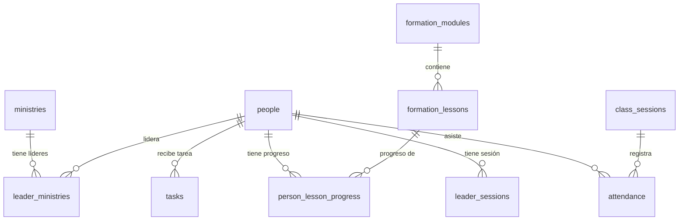

# Relaciones en PostgreSQL

## ¿Qué es una llave foránea?

Una llave foránea (`FOREIGN KEY` o `REFERENCES`) es una columna que apunta al `id` de otra tabla. Garantiza que no puedas referenciar algo que no existe.

## Ejemplo en este proyecto

```sql
-- formation_lessons tiene una columna module_id que apunta a formation_modules
CREATE TABLE formation_lessons (
  id        uuid PRIMARY KEY,
  module_id uuid NOT NULL REFERENCES formation_modules(id),
  title     text NOT NULL
);
```

Si intentas insertar una lección con un `module_id` que no existe en `formation_modules`, PostgreSQL lo rechaza:
```
ERROR: insert or update on table "formation_lessons" violates foreign key constraint
```

## Tipos de relaciones en el proyecto

### Uno a muchos (1:N)
Un módulo tiene muchas lecciones. Una lección pertenece a un solo módulo.

```
formation_modules (1) ──── (N) formation_lessons
```

### Muchos a muchos (N:M)
Una persona puede liderar varios ministerios. Un ministerio puede tener varios líderes.
Se resuelve con una tabla intermedia:

```
people (N) ──── leader_ministries ──── (M) ministries
```

```sql
CREATE TABLE leader_ministries (
  person_id   uuid REFERENCES people(id),
  ministry_id uuid REFERENCES ministries(id),
  UNIQUE (person_id, ministry_id)  -- no duplicados
);
```

## ON DELETE CASCADE

Cuando se borra el padre, ¿qué pasa con los hijos?

```sql
REFERENCES formation_modules(id) ON DELETE CASCADE
```

`CASCADE` = si borras un módulo, se borran automáticamente todas sus lecciones.

Alternativas:

| Opción | Comportamiento |
|---|---|
| `CASCADE` | Borra los hijos automáticamente |
| `RESTRICT` (default) | Bloquea el borrado si hay hijos |
| `SET NULL` | Pone NULL en la llave foránea del hijo |

En este proyecto usamos `CASCADE` para que al borrar un módulo no queden lecciones huérfanas.

## Diagrama de relaciones del proyecto


