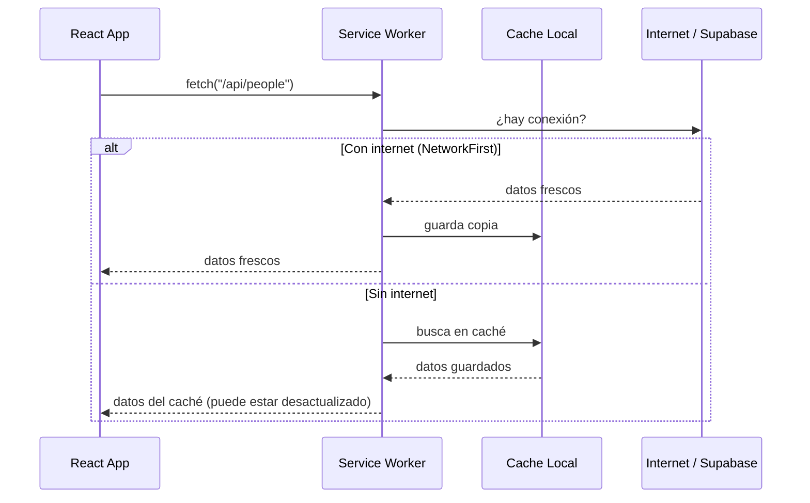

# PWA y Service Worker

## ¿Qué es una PWA?

Una Progressive Web App (PWA) es una app web que se comporta como una app nativa:
- Se puede **instalar** en el celular sin pasar por la App Store
- Funciona **offline** (o parcialmente) cuando no hay internet
- Tiene un **ícono** en la pantalla de inicio
- Se abre en pantalla completa sin la barra del navegador

Para ESLIDER esto importa porque los líderes usarán la app desde el celular, posiblemente en zonas con señal intermitente.

## ¿Qué es el Service Worker?

Es un script JavaScript que corre **en segundo plano**, separado de la app. Actúa como intermediario entre la app y la red:



## Workbox — la librería que usamos

Workbox (de Google) simplifica la configuración del Service Worker. La estrategia que configuramos para Supabase es **NetworkFirst**:

1. Primero intenta obtener datos frescos de internet
2. Si falla, sirve la última versión guardada en caché

Esto es ideal para una app de gestión: siempre quieres los datos más recientes, pero si no hay señal, es mejor ver datos viejos que no ver nada.

## El Manifest

El archivo `manifest.webmanifest` define cómo se ve la app cuando se instala:

```json
{
  "name": "ESLIDER Ministry",
  "short_name": "ESLIDER",
  "theme_color": "#1e40af",
  "icons": [{ "src": "icon-192.png", "sizes": "192x192" }],
  "display": "standalone"  ← abre sin barra del navegador
}
```

## ¿Cómo se instala?

En Chrome/Android, cuando visitas la app aparece un banner "Agregar a pantalla de inicio". En iOS (Safari), hay que hacerlo manualmente desde el menú compartir → "Agregar a pantalla de inicio".

## En este proyecto

Configurado con `vite-plugin-pwa` en `vite.config.ts`. No necesitas tocar el Service Worker manualmente — Workbox lo genera automáticamente en el build.
