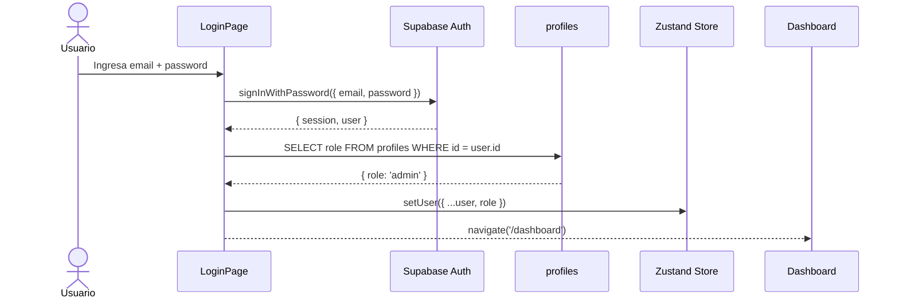
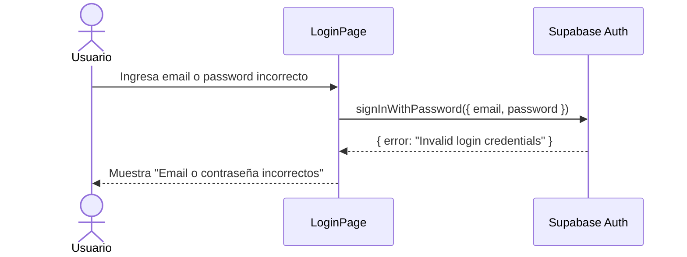

# UC-01 — Login

## Descripción
El usuario (admin, secretario o pastor) ingresa sus credenciales para acceder a la app.

## Actores
- Admin, Secretario, Pastor

## Precondiciones
- El usuario ya fue creado en Supabase Auth por el admin

## Flujo principal

## Flujo alternativo — Credenciales incorrectas

## Postcondiciones
- El JWT queda guardado en localStorage por Supabase automáticamente
- El rol del usuario queda en el Zustand store
- El usuario ve el dashboard según su rol
