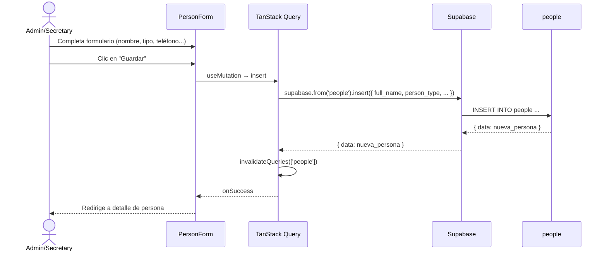
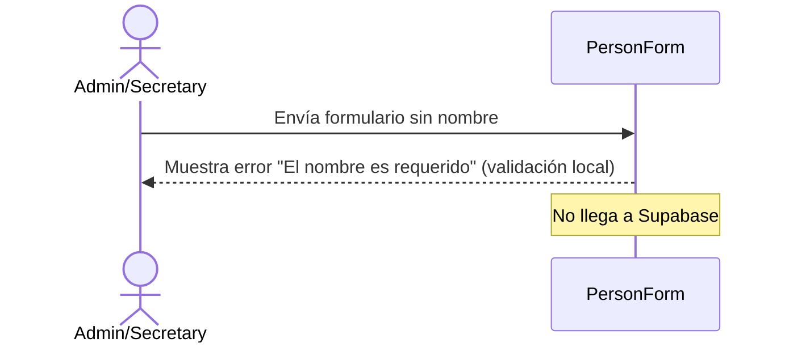

# UC-02 — Registrar Persona

## Descripción
El admin o secretario registra una nueva persona (miembro, creyente o visitante).

## Actores
- Admin, Secretario

## Precondiciones
- Usuario autenticado con rol `admin` o `secretary`

## Flujo principal

## Flujo alternativo — Validación fallida

## Campos del formulario
| Campo | Requerido | Notas |
|---|---|---|
| Nombre completo | ✅ | |
| Tipo | ✅ | miembro / creyente / visitante |
| Teléfono | ❌ | |
| Email | ❌ | |
| Dirección | ❌ | |
| Fecha de nacimiento | ❌ | |
| Notas | ❌ | |

## Postcondiciones
- Nueva fila en `people`
- Lista de personas se actualiza automáticamente (TanStack Query invalida caché)
