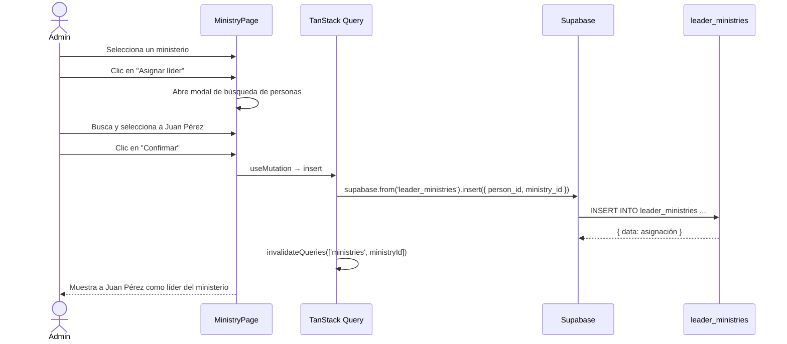
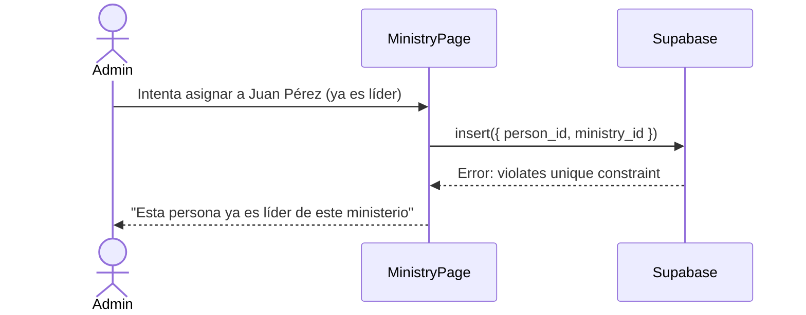

# UC-03 — Asignar Líder a Ministerio

## Descripción
El admin asigna una persona como líder de uno o más ministerios.

## Actores
- Admin, Secretario

## Precondiciones
- La persona ya está registrada en `people`
- El ministerio ya existe en `ministries`

## Flujo principal

## Flujo alternativo — Ya es líder de ese ministerio

## Postcondiciones
- Nueva fila en `leader_ministries`
- Un ministerio puede tener varios líderes
- Una persona puede liderar varios ministerios
