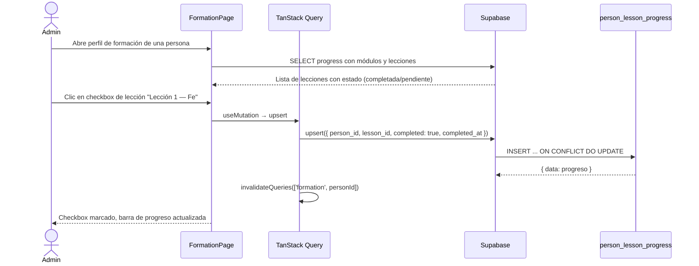
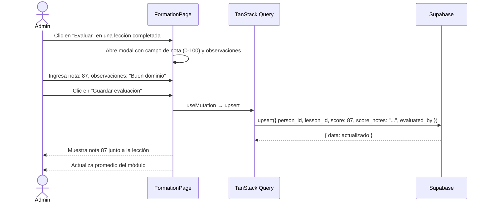

# UC-04 — Registrar Progreso de Formación

## Descripción
El admin o secretario marca una lección como completada y opcionalmente registra una nota de evaluación para una persona.

## Actores
- Admin, Secretario

## Precondiciones
- La persona existe en `people`
- Los módulos y lecciones están definidos en `formation_modules` y `formation_lessons`

## Flujo principal — Marcar lección completada



## Flujo alternativo — Registrar nota de evaluación



## Cálculo de promedios

```
Promedio módulo = AVG(score) de lecciones con score IS NOT NULL
Promedio general = AVG(promedios de módulos)
```

Las lecciones completadas SIN nota no afectan el promedio — solo las evaluadas.

## Postcondiciones
- Fila en `person_lesson_progress` creada o actualizada
- Barra de progreso del módulo refleja el avance
- Promedio actualizado si se registró nota
