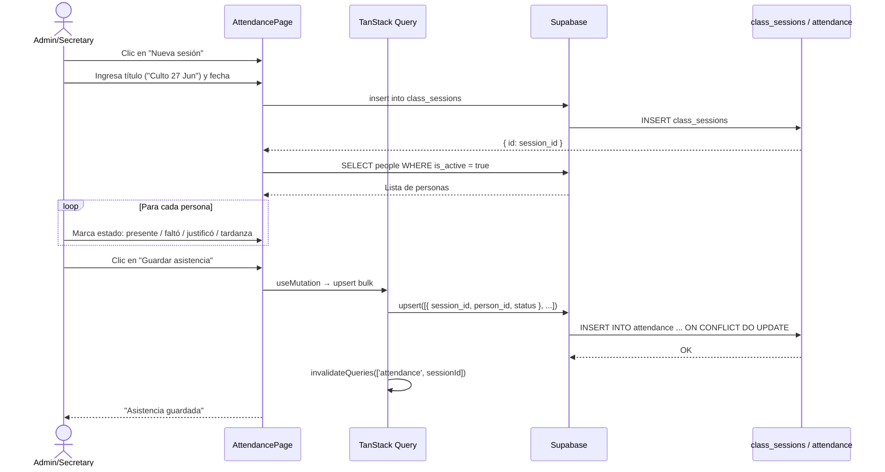
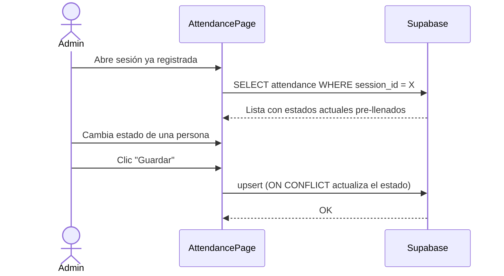

# UC-05 — Registrar Asistencia

## Descripción
El admin o secretario crea una sesión de clase/culto y registra la asistencia de cada persona.

## Actores
- Admin, Secretario

## Flujo principal

## Flujo alternativo — Editar asistencia ya registrada

## Estados de asistencia

| Estado | Código | Descripción |
|---|---|---|
| Asistió | `present` | Estuvo presente |
| Faltó | `absent` | No asistió sin justificación |
| Justificó | `justified` | Avisó con anticipación |
| Tardanza | `late` | Llegó tarde |

## Postcondiciones
- Fila en `class_sessions` creada
- Filas en `attendance` creadas o actualizadas (una por persona)
- Los reportes de alertas pueden calcular faltas consecutivas
