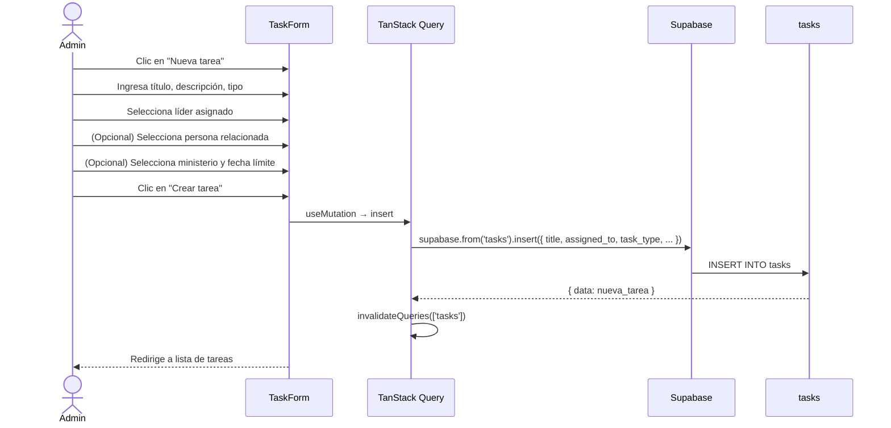
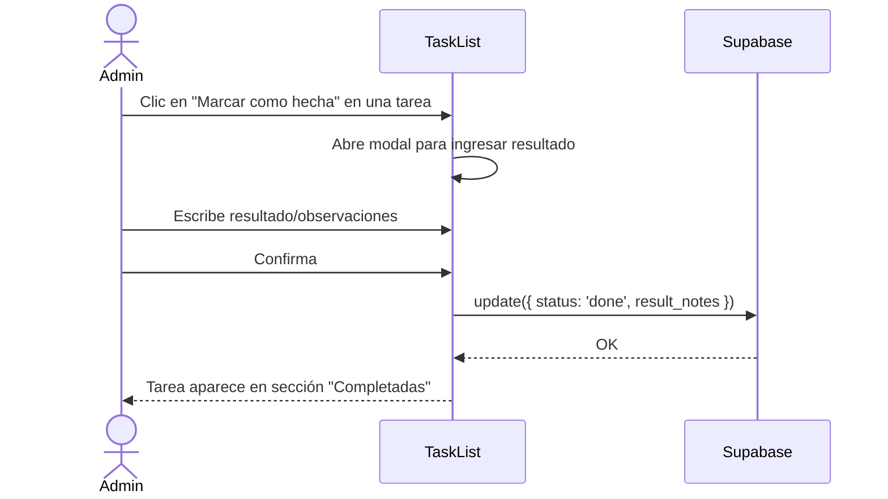

# UC-06 — Delegar Tarea a Líder

## Descripción
El admin delega una tarea (visita, administrativa u otra) a un líder, con fecha límite opcional.

## Actores
- Admin, Secretario

## Flujo principal

## Flujo alternativo — Marcar tarea como completada

## Tipos de tarea

| Tipo | Código | Ejemplo |
|---|---|---|
| Visita | `visit` | "Visitar a María García esta semana" |
| Administrativa | `administrative` | "Coordinar el ensayo del domingo" |
| Otra | `other` | Cualquier otra actividad |

## Postcondiciones
- Nueva fila en `tasks` con `status: 'pending'`
- Visible en el listado de tareas del líder asignado
- Aparece en alertas del dashboard si pasa la fecha límite sin completarse
