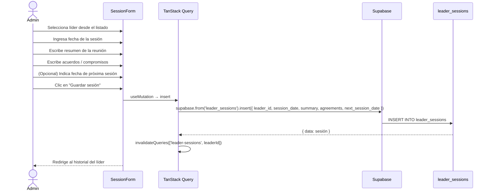
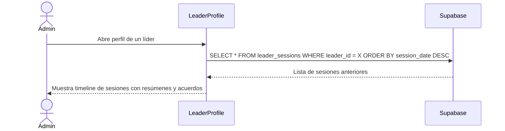

# UC-07 — Registrar Sesión 1:1 con Líder

## Descripción
El admin registra los detalles de una reunión personal con un líder: resumen, acuerdos y fecha de próxima sesión.

## Actores
- Admin, Secretario

## Flujo principal

## Flujo — Ver historial de sesiones de un líder

## Postcondiciones
- Nueva fila en `leader_sessions`
- El historial del líder se actualiza automáticamente
- Si se indicó próxima sesión, puede mostrarse como recordatorio en el dashboard
