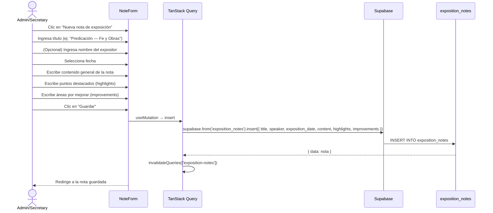

# UC-08 — Registrar Nota de Exposición

## Descripción
El admin o secretario registra una nota de una exposición/prédica, con secciones para puntos destacados y áreas de mejora.

## Actores
- Admin, Secretario

## Flujo principal



## Estructura de una nota

```
Título: Predicación sobre la Fe
Expositor: Pastor Martínez
Fecha: 27/06/2026

Contenido general:
  Texto libre con el resumen de la exposición...

Puntos destacados (✅):
  - Ilustración del sembrador muy clara
  - Buena aplicación práctica al final

Por mejorar (🔧):
  - El punto 2 quedó incompleto por el tiempo
  - Sería bueno más versículos de apoyo
```

## Postcondiciones
- Nueva fila en `exposition_notes`
- La nota queda disponible para consulta futura
