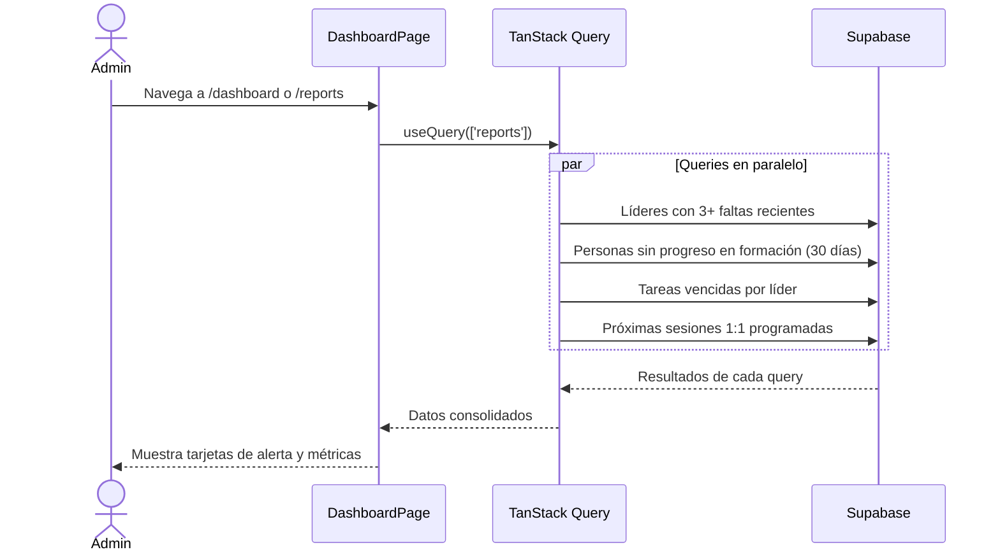

# UC-09 — Dashboard de Reportes y Alertas

## Descripción
El admin visualiza un dashboard con métricas generales y alertas sobre líderes que requieren atención.

## Actores
- Admin, Secretario, Pastor (solo lectura)

## Flujo principal



## Alertas del dashboard

### 🔴 Líderes con faltas consecutivas
Líderes con 3 o más faltas en los últimos 30 días.

```sql
SELECT p.full_name, COUNT(*) as absences
FROM attendance a
JOIN people p ON p.id = a.person_id
WHERE a.status = 'absent'
  AND a.created_at >= NOW() - INTERVAL '30 days'
GROUP BY p.id, p.full_name
HAVING COUNT(*) >= 3
ORDER BY absences DESC;
```

### 🟡 Personas sin avance en formación
Personas que no han registrado progreso en los últimos 30 días.

```sql
SELECT p.full_name
FROM people p
WHERE p.is_active = true
  AND p.id NOT IN (
    SELECT DISTINCT person_id
    FROM person_lesson_progress
    WHERE updated_at >= NOW() - INTERVAL '30 days'
  );
```

### 🟠 Tareas vencidas
Tareas que pasaron su fecha límite sin completarse.

```sql
SELECT t.title, p.full_name as leader, t.due_date
FROM tasks t
JOIN people p ON p.id = t.assigned_to
WHERE t.status != 'done'
  AND t.due_date < CURRENT_DATE
ORDER BY t.due_date;
```

### 📅 Próximas sesiones 1:1
Líderes con sesión 1:1 programada en los próximos 7 días.

```sql
SELECT p.full_name, ls.next_session_date
FROM leader_sessions ls
JOIN people p ON p.id = ls.leader_id
WHERE ls.next_session_date BETWEEN CURRENT_DATE AND CURRENT_DATE + 7
ORDER BY ls.next_session_date;
```

## Métricas generales

| Métrica | Descripción |
|---|---|
| Total de personas activas | COUNT people WHERE is_active = true |
| % de asistencia del último mes | present / total registros del mes |
| Módulos completados este mes | lecciones con completed_at en el mes |
| Promedio general de notas | AVG(score) WHERE score IS NOT NULL |

## Postcondiciones
- El dashboard es de solo lectura — no modifica datos
- Se actualiza cada vez que el usuario navega a la pantalla (TanStack Query refetch on focus)
